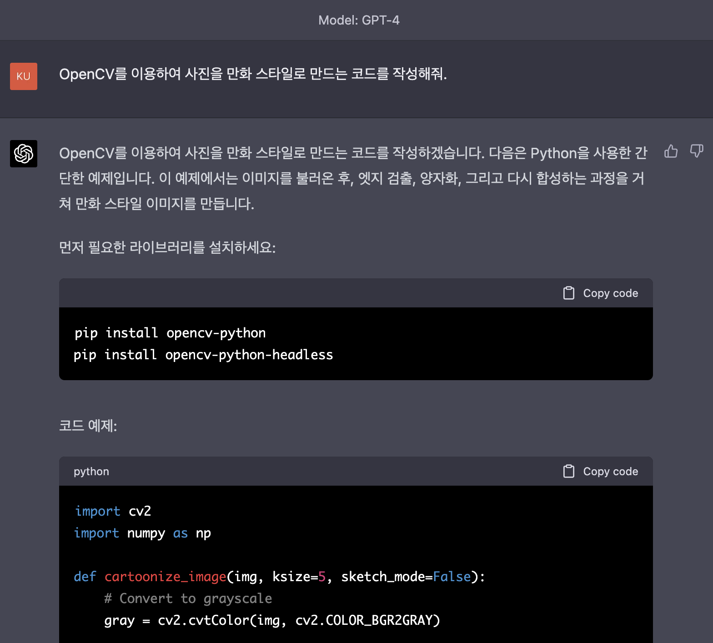
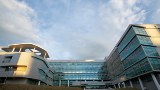
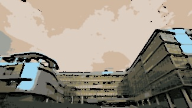
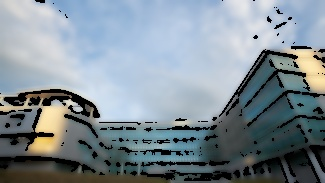

# battleofmirae
미래관을 만화화 스타일로 변환하기 위한 인간과 ChatGPT의 대결  
미래(관)이 달린 문제...

## Man(인간) 방식
유튜브 참고자료를 따라하는 것으로 Jupyter Notebook [파일](./man.ipynb)을 통한 단계별 진행

### 방식 설명
1. Edge Mask 만들기
2. 색상 양자화(이미지 색상 가짓수 줄이기)
3. 노이즈 제거
4. Edge Mask와 양자화된 이미지 결합

### 참고자료
[Cartoon Effect on Image using OpenCV](https://www.youtube.com/watch?v=2xqvGZS7NCw)

## GPT4 방식
일반적으로 공개된 GPT3.5 모델은 흔할 것 같아 GPT4 모델을 통해 [코드](./gpt4.py)를 생성

### 프롬프트

### 방식 설명
1. Grayscale로 변환
2. Median Blur 적용
3. Adaptive threshold로 Edge 검출
4. Bilateral Filter 적용
5. Edge와 색상 Bilateral Filter를 적용한 이미지 결합

## 결과물 비교
| 원본 | 인간 | GPT4 |
|-----|-----|------|
||||

인간 방식은 옛날 Windows 9x 시절 256 색상모드로 바탕화면을 보는듯이 하늘에 대한 색상 표현이 떨어진다.  
유리창의 창살을 봤을땐 표현이 GPT 방식에 비해 인간 방식이 섬세하다.

## 그래서 누가 이긴것인가?
보는 사람, 처리하는 인공지능 모델에 따라 이미지에 대한 호불호가 갈릴것이다.
